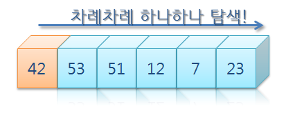

# 프로그래밍 수련법 2-1 검색

## 순차검색 Sequential Search

**검색조건 :** 

0 ~ 100,000까지의 숫자를 랜덤으로 정렬하여 100,000개 생성된 숫자 리스트를 순차적으로 검색

```cpp
#include <stdio.h>
#include <stdlib.h>
#include <time.h>

int main() {
    srand(time(NULL));

    // 리스트의 길이 = 십만
    int arraySize = 100000;

    // 1부터 백만 사이의 숫자로 랜덤 숫자 생성
    int randomArray[arraySize];
    for (int i = 0; i < arraySize; ++i) {
        randomArray[i] = rand() % 100000 + 1; 
    }

    // 찾으려는 값
    int target = 2425;

    // 선형검색
    int foundIndex = -1;
    for (int i = 0; i < arraySize; ++i) {
        if (randomArray[i] == target) {
            foundIndex = i;
            break; 
        }
    }

    if (foundIndex != -1) {
        printf("Target %d found at index %d\n", target, foundIndex);
    } else {
        printf("Target %d not found in the array.\n", target);
    }

    return 0;
}
```

### 순차검색의 검색방식



순차적으로 검색하기 때문에 방식은 매우 단순하지만 검색하고자 하는 전체 데이터의 크기가 작업량과 비례하여 찾고자 하는 원소가 존재하지 않을때 검색시간은 두배로 늘어난다.

실행시간과 데이터 크기가 일차함수 관계이므로 이것은 선형관계를 나타내고 이런 식의 검색 방식은 선형 검색(Linear Search)이라고 부른다 

배열의 크기가 적당하거나 적을 때는 빠른 속도로 검색을 한다. 배열의 크기가 크지 않을 때 순차검색 방식을 사용하는 것이 코드의 간결성이나 시간적인 측면에서도 효율적이다.

### 리소스 모니터링

아래 리소스 모니터링을 참고해 ‘2425’라는 원소를 찾지 못하였을때 리소스는 50% 이상으로 증가한다. 반면 16666번째, 20426번째에서 검색 되었던 초반의 경우 25~30%대를 유지하고 있다.


## 이진검색 Binary Search

**검색조건 :** 

0 ~ 100,000까지의 숫자를 랜덤으로 정렬하여 100,000개 생성된 숫자 리스트를 오름차순 정렬하여 이진검색

```cpp
int compare(const void *a, const void *b) {
    return (*(int *)a - *(int *)b);
}

int binarySearch(int A[], int n, int x){
	int low = 0, high = n-1;
	while(low<=high)
	{
		int mid = (low+high)/2;
		if(x == A[mid]) return mid; 
		else if(x < A[mid]) high = mid-1;
		else low = mid+1;
	}
	return -1;
}

int main() {
    srand(time(NULL));

    int arraySize = 100000; 

    int randomArray[arraySize];
    for (int i = 0; i < arraySize; ++i) {
        randomArray[i] = rand() % 100000 + 1; 
    }

    // 배열 정렬하기
    qsort(randomArray, arraySize, sizeof(int), compare);

    // 찾을 값
    int target = 2425;

    // 이진검색 시작
    int result = binarySearch(randomArray, arraySize, target);

    if (result != -1) {
        printf("Target %d found at index %d\n", target, result);
    } else {
        printf("Target %d not found in the array.\n", target);
    }

    return 0;
}
```

### 

### 이진검색의 검색방식


주로 대규모 배열에서 사용되는 검색방식으로 순차검색과 다르게 배열의 원소를 크기순으로 정렬하고, 전체 배열을 반으로 나눈다 → 배열의 중간 원소가 찾으려는 원소보다 크다면 앞쪽의 배열을 검색 범위로 사용한다.

그리고 찾으려는 키값을 찾거나 없음을 알기까지 같은 방식을 반복하는 방식.

### 리소스 모니터링

아래 리소스 모니터링을 참고해 ‘2425’라는 원소를 찾지 못하였을때 리소스는 30% 이상으로 증가한다. 

배열의 원소를 크기순으로 정렬했기 때문에 발견된 인덱스는 찾으려는 원소 ‘2425’와 크게 차이나지 않는다.


대규모 배열에서는 이진검색이 적절한 검색방식이 될 수 있고, 선형검색은 배열의 원소가 1000개라면 1000번 검색 하지만 이진검색은 10번만 실행하면 원소를 찾거나 없음을 알 수 있다.

현재의 컴퓨터 리소스로는 단순한 숫자 100만개의 원소를 검색해도 이진검색과 순차검색의 검색시간의 차이는 느끼기 어려웠으나, 리소스 모니터링을 통해 대규모 배열에서 순차검색은 이진검색보다 많은 리소스를 사용하고 있음을 알 수 있다.

이러한 결과가 문자열 여러개를 다수의 사용자가 검색한다고 가정하면 검색 방식에 따른 효율성은 무시할 수 없는 부분이라는 것을 알 수 있다.
