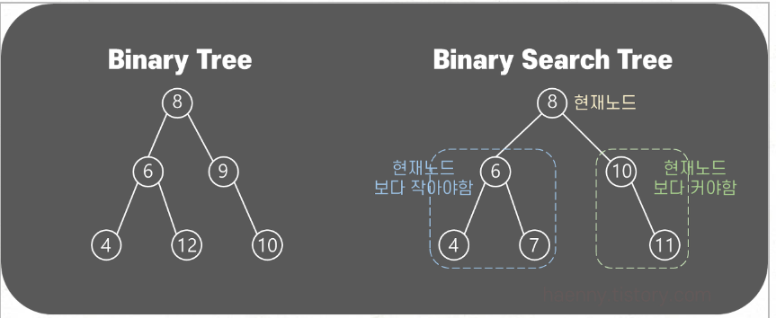

# 2.8 트리

## 트리?
- 트리는 아이템(노드) 마다 어떤 값을 가지고 있고 0개 또는 그 이상의 다른 아이템(노드)를 가르킬수 있다.


- 트리의 구조 종류 : 삼항 트리, 이진 트리, 이진 검색 트리(왼쪽 노드의 데이터가 현재 가르키고 있는 노드보다 작고 오른쪽 노드의 데이터는 현재가르키고 있는 노드보다 커야함) 
- 이진 검색 트리는 탐색 시간이 O(log N) 이다!
    


- Nameval을 이진 검색 트리로 나타낸다. 좌우 분류 기준은 이름을 나타내는 문자열의 아스키 값이다.
``` c++
typedef struct Nameval Nameval;
struct Nameval{
    char    *name;
    int     value;
    Nameval *left;  //작은 값을 같는 노드
    NameVal *right; //큰 값을 같는 노드
};
```

## 입력 함수 
```c++
//insert : newp를 treep에 추가하고 treep 를 리턴
Nameval* insert(Nameval* treep, Nameval* newp) {
	int cmp;

	if (treep == NULL) { return newp; }

	cmp = strcmp(newp->name, treep->name);  //strcmp로 현재 node 의  name과 입력할 node의 name 을 비교해 작으면 -1 를 높으면 +1를 같으면 0

	if (cmp == 0) {
		weprintf("insert: duplicate entry %s ignored", newp->name);
	}
	else if (cmp < 0) { // 작으면 현재 노드의 왼쪽 자식 노드 로 넘어간다.
		treep->left = insert(treep->left, newp);
	}
	else {  // 높으면 현재 노드의 오른쪽 자식 노드로 넘어간다.
		treep->right = insert(treep->right, newp);
	}
	return treep;
}
```
- 위의 입력 함수에서는 데이터가 중복될때 경고만뜨고 입력은 되지 않는다.
- 입력 데이터들이 정렬 되어 들어오면 트리의 구조가 한쪽으로만 뻗어나가 리스트와 다를게 없어진다.
- 따라서 입력 데이터들이 무작위로 입력되면 어느정도 밸런스가 맞춰질 것이다.
- 여기서의 밸런스는 좌우의 높이를 뜻한다.

## 탐색
- 찾고자 하는 이름이 있는지 재귀적으로 탐색하는 함수이다.
- 이진 탐색과 비슷하게 O(log n)이다.
```cpp
// lookup : treep 트리에서 name을 겁색
Nameval* lookup(Nameval* treep, char* name)
{
	int cmp;
	if (treep == NULL) return NULL;
	cmp = strcmp(name, treep->name);
	if (cmp == 0) {
		return treep;
	}
	else if (cmp < 0) {
		return lookup(treep->left, name);
	}
	else {
		return lookup(treep->right, name);
	}
}
```
- 이런식으로 아이템을 찾지 못할때 자기 자신을 리턴하는 재귀함수를 호출하는 방식을 꼬리 재귀 방식 이라고 한다.

```cpp
//nrlookup : 비재귀적으로 treep 트리에서 name을 검색
Nameval* nrlookup(Nameval* treep, char* name) {
	int cmp;

	while (treep != NULL) {
		cmp = strcmp(name, treep->name);
		if (cmp == 0) return treep;
		else if (cmp < 0) treep = treep->left;
		else treep = treep->right;
	}
	return NULL;
}
```
- 위 코드처럼 재귀방식을 사용하지 않고 반복문을 사용해서 표현도 가능하다.

## 다른 연산 만들기

- 트리를 순회하는 방법을 위에서 배웠으니 이를 이용해서 다른 연산도 만들수 있다.
- 리스트에서의 apply와 비슷하게 트리에서는 노드마다 어떤 함수를 불러서 문제를 해결하는 범용 트리 순회 함수를 만들 수 있다.
- 트리를 순회할 방향과, 언제 노드를 함수에 전달할지 등을 고려해야 한다.
- 예를 들어 이진 검색 트리면 왼쪽 절반을 오른쪽 절반보다 먼저 처리를 해야하고, 족보처럼 트리 구조가 되어 있으면 트리가 표현하는 관계에 따라 리프 노드를 방문하는 순서가 달라진다.


[ref]


https://haenny.tistory.com/345

https://velog.io/@vermonter/Data-Structure-%EC%9D%B4%EC%A7%84-%ED%8A%B8%EB%A6%ACBinary-Tree%EC%9D%98-%EC%84%B8-%EA%B0%80%EC%A7%80-%EC%A2%85%EB%A5%98%EC%99%80-%ED%8A%B9%EC%A7%95
