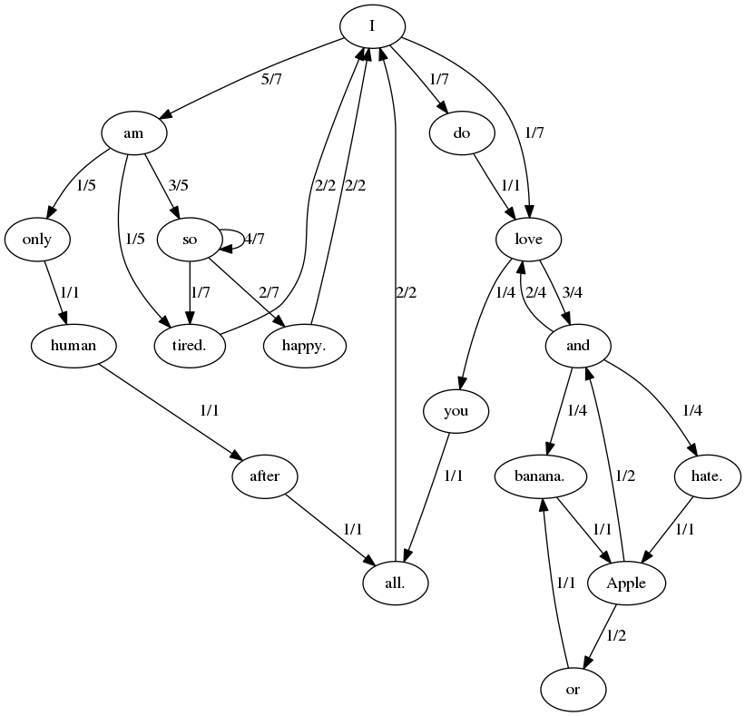

# 프로그래밍 수련법 3-2 데이터 구조 후보들

### **데이터 구조 설계 이유:**

1. **접두사와 접미사의 관계 표현:**
    - **접두사 (Prefix):** 마르코프 체인에서는 이전 상태(previous state)를 나타내는 접두사를 기반으로 다음 상태를 예측. 예를 들어, 텍스트에서 각 단어가 접두사가 될 수 있음.
    
    - **접미사 (Suffix):** 각 접두사에 대한 가능한 다음 단어들의 상태(state) 저장하는 것이 중요합니다. 이러한 관계를 나타내기 위해 해시 테이블을 사용함.
    - 해시 테이블의 각 키(접두사)에 대응하는 값(접미사 목록)을 저장함으로써, 주어진 접두사 다음에 올 수 있는 다양한 접미사들을 기억할 수 있음.
    
    - ****접두사와 접미사 간 관계 확립:**** 예측을 위해 주어진 접두사에 대해 해당하는 접미사를 찾을 수 있습니다. 이렇게 함으로써 특정 문맥에 대한 다음 단어 예측이 가능.
        
        
        ```cpp
        (HashTable)
        
          key          value
        [접두사] --> [접미사1]
           |
           +-------> [접미사2]
           |
           +-------> [접미사3]
        
        ```
        
        각 노드는 특정 접두사를 나타내며, 각 엣지는 해당 접두사와 연결된 가능한 접미사. 
        
        특정 접두사(문맥)에 대해 다음에 올 수 있는 가능한 접미사(다음 단어 후보)를 예측하는 과정.
        
2. 2-1 ****접두사 (Prefix)와 해시 테이블의 키:****
    - **의미:** 접두사는 특정 문맥을 나타냅니다. 예를 들어, "The cat"이라는 문장에서 "The cat"은 접두사가 될 수 있습니다. 이러한 문맥은 텍스트의 특정 부분을 나타내며, 이 문맥에서 다음에 나올 단어를 예측하는 데 사용됩니다.
    - **해시 테이블의 키로 사용 이유:** 해시 테이블은 매우 빠른 검색 속도를 제공합니다. 특정 문맥(접두사)에 대한 예측을 빠르게 수행하기 위해, 접두사는 해시 테이블에서 키로 사용됩니다.
    
    2-2 ****접미사 (Suffix)와 해시 테이블의 값:****
    
    - **의미:** 접미사는 특정 접두사 이후에 나올 수 있는 단어 후보를 나타냅니다. 예를 들어, "The cat" 접두사에 대한 접미사로 "is," "sat," "ran" 등이 올 수 있습니다.
    - **해시 테이블의 값으로 사용 이유:** 각 접두사(키)에 대응하는 접미사(값) 목록은 가능한 다음 단어 후보를 저장합니다. 이 목록은 중복을 허용하며, 접두사에 대한 여러 다음 단어 후보들을 관리하기 위해 해시 테이블의 값으로 사용됩니다.
    

**예제 구현**

```cpp
Test string is:
"I am only human after all.",
"I am so tired. I am so happy.", 
"I am tired. I am so so so so so happy.",
"I do love and love and love you all.",
"I love and hate.",
"Apple or banana.",
"Apple and banana.",

Let's generate something:
Chain No. 1
"I am so so so happy.",
"I am so so happy.",
"I do love and hate.",
"Apple or banana.",
"Apple and love and banana.",
"Apple and love and love you all.",
"I do love and hate. Apple and banana.",
"Apple and banana.",
"Apple or banana.",
"Apple and hate.",
"Apple or banana.",
"Apple and love and banana.",
"Apple or banana.",
"Apple or banana.",
"Apple and hate.",
"Apple or banana.",
"Apple or banana.",
"Apple or banana.",
"Apple or banana.",
"Apple or banana.",
"Apple or banana.",
"Apple or banana.",
"Apple or banana.",
"Apple and banana.",
"Apple and love and love and banana.",
"Apple"

Chain No. 2
"I am only human after all.",
"I do love and love and love and love you all.",
"I do love you all. I do love and love and love you all.",
"I am only human after all. I am so tired. I am only human after all.",
"I love and banana. Apple and love and hate. Apple and love you all.",
"I am so happy. I am so happy. I am so so so happy.",
"I love and love and hate. Apple and hate. Apple and hate.",
"Apple or banana.",
"Apple and banana.",
"Apple and love and banana.",
"Apple and"

Chain No. 3
"I do love you all.",
"I am so so so so so so so so so happy.",
"I am only human after all.",
"I am so so so so so so so so happy.",
"I am only human after all. I am tired.",
"I do love and love and banana.",
"Apple and love you all.",
"I am so so so tired.",
"I am so so so happy.",
"I do love you all.",
"I am so so so tired.",
"I am so happy. I am so so so happy.",
"I love and love and love and love and hate.",
"Apple and"
```

### 최적화 설계를 위한 데이터 구조**:**

1. **중복 제거와 메모리 절약:**
    - 동일한 접두사가 여러 번 나올 수 있습니다. 중복된 접두사를 효율적으로 저장하고, 메모리를 효율적으로 사용하기 위해 중복을 제거하는 방법이 필요합니다. 여러 방법 중 하나는 해시 테이블을 사용하여 중복을 방지하고 메모리를 절약할 수 있습니다. 동일한 접두사가 중복되면 해당 접두사에 대한 접미사 목록을 업데이트하면 됩니다.
    - 각 해시 테이블의 값으로는 동적 배열(**`std::vector`** 또는 **`std::list`**)을 사용하여 중복된 단어를 저장합니다. 이렇게 하면 중복을 허용하면서 메모리를 효율적으로 사용할 수 있습니다.
    
    ```cpp
    [접두사] --> [동적 배열(접미사1, **접미사2**, ...)]
              |
              +--> [동적 배열(접미사3, ...)]
              |
              +--> [동적 배열(**접미사2**, 접미사4, ...)]
    
    [접두사: I am] --> [접미사1: happy]
                      |
                      +--> [접미사2: joyful]
                      |
                      +--> [접미사3: content]
                      |
                      +--> [접미사4: with]
    
    [접미사 접두사 매칭 이후 중복 제거]
    ```
    
    **중복된 단어 삽입:** 접미사를 동적 배열에 저장할 때, 중복된 단어를 허용합니다. 예를 들어, 특정 접두사에 대해 여러 번 나온 단어는 같은 단어를 여러 번 배열에 추가할 수 있습니다.
    
    **중복된 단어 검색 및 예측:** 예측을 위해 특정 접두사에 대한 접미사를 검색할 때, 중복된 단어를 고려하여 해당 동적 배열에서 단어를 선택합니다.
    
2. **데이터 일관성 유지:**
    - 해시 테이블을 사용하면 데이터를 일관되게 유지할 수 있습니다. 각 접두사에 대한 접미사 목록을 해시 테이블에 저장하면, 데이터의 일관성을 보장하면서도 효율적인 탐색을 가능케 합니다.
    

이러한 이유로 **접두사와 접미사를 해시 테이블을 활용하여 저장하는 것이 마르코프 체인을 구현하기 위한 효과적인 방법입니다**. 해시 테이블은 **중복을 허용하지 않으면서 빠른 탐색이 가능**하며, 동적으로 크기를 조절할 수 있는 유연성을 제공합니다. 이러한 데이터 구조를 통해 텍스트 생성 및 예측과 같은 작업을 수행하는데 필요한 핵심 기능을 구현할 수 있습니다.           


