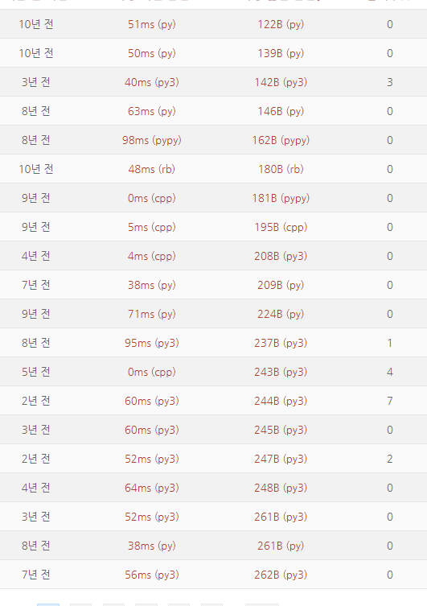

## 추정
### 이 장의 의도
- 프로그램이 얼마나 빠르게 수행될 지 추정하는 것은 어려운 일임. 
- 우리는 경험적으로 어떤 명령이 얼마나 빠르게 수행되었는지를 알 수 있고, 
- 이를 근거로 내 코드에 어떤 것이 있으니 얼마나 빠르게 수행될 지 예상할 수 있음. 

### 빅오 표기법? 
- 유사하게 빅오 표기법 (big-O notation.  O(n) ) 이 있지만, 최악의 경우의 수행시간 비교에 쓰임. 
- 아주 거북이 같은 코드 한줄이 반복하여 실행하는 무수히 많은 코드보다 오래 걸릴 수 있음.
  - 빅오를 통한 성능은 "반복성" (n의 2승이냐, 3승이냐 등등..) 을 확인하는 것이지 아주 오래 걸리는 코드 (Disc I/O ? 장시간 처리 코드? ) 를 찾아내는 것은 아님. 
  - 지구 주변 인공위성이랑 수도 없이 통신하는 위성이 아무리 많이 통신해도, 명왕성 밖으로 벗어난 보이저 위성과 한번 통신하는 것보단 빠르겠죠. 
  - 이와 같이 physical disc 에 접근하는 것과 같은 아주 오래 걸리는 한번의 명령이 몇단계 반복하는 cpu 명령보다 훨씬 오래 걸릴 수 있습니다.

### 어쩌면 우리가 알고 있는 느린 추정에 대한 대비 방법들
- 우리는 이렇게 반복적이지 않아도 느린 것을 극복하기 위해서 많은 새로운 방법들을 써왔습니다. 
  - 컴퓨터 내 버스 효율을 높이는 북쪽다리와 남쪽다리 (north bridge, south bridge) : https://en.wikipedia.org/wiki/Northbridge_(computing)
    - 최근 아키텍처에서는 다시 사라졌다 함. 
  - Disc I/O 가 느려서 하는 DMA (Direct Memory Access) 
  - 언어를 변경하여 최적화 (주로 타 언어에서 C / C++로 변환)
- 따라서 우리의 코드 중 어떤 부분이 느린지는 우리가 경험적으로 먼저 많은 요소를 검토하여 최적화 할 수 있음.

언어별 OJ (Online Judge) 에서 속도 차이

- 알고스팟(algospot) 에서 모 문제에 제출된 답안 별 수행속도
- C / C++ 을 이기기는 어려움. (수행시간 0 ~ 5ms)
- 루비 (rb) : 48ms, python, python3, pypy : 38 ~ 98ms 등.

  

### 책에서 나온 내용들
- 정수(integer) / 실수(float) / 실수(double) 의 가감승제 등
- 정수 벡터 연산, 제어문 구조, 입력/출력, 문자열 함수, 수학함수 등

### 책에서 나온 내용을 그대로 믿어도 될까요? 
- 곱셈은 값을 곱할 때 shift 연산 + 덧셈 연산 의 조합으로계산 됨. (RISC cpu 기준)
  - 그러면 이진수로 했을 때 나오는 이진수의 1의 갯수 만큼 shift, add 를 해야만 함. ( ex. 7 = 0111b, 3번 shift, add 해야 함. )
- 정수와(integer), 실수(float, double) 의 덧샘은 시간이 같기가 어려움.
  - 실수의 경우 자리를 맞춰주고 가/감/승/제 해야 하기 때문에 정수에 비하여 많은 시간이 들 수 밖에 없음.

